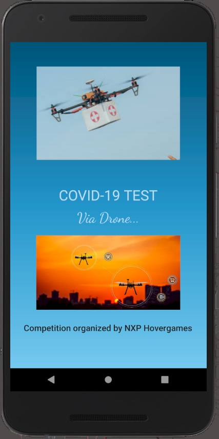
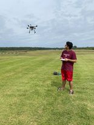
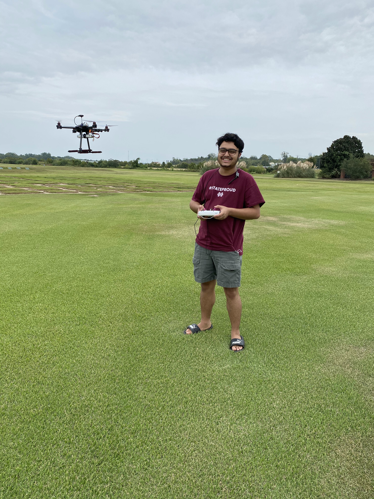

# Hovergames-Challenge2
Repo for documentation purpose  

[HoverGames Competition Submission](https://www.hackster.io/ajayadahal1000/covid-19-testing-service-via-drone-65c52a).  

# Abstracts:
During this unprecedented time of global crisis, the graph of the total number of cases and the total number of deaths is continuously climbing up and there is no sign of slowing down the spread of this epidemic anytime soon. The main cause of having so many fatalities and infections is due to lack of social distancing which is one of the main methods to slow down the spread of this infection. Unfortunately, if anyone is not feeling well and wants to get tested for the possible infection, he/she has to physically present themselves to submit the sample. Since the number of cases are increasing day by day testing facilities are also crowded. During their presence in any location there is a high chance of spreading their infection to numbers of other individuals. So, it is never a good idea to go to the testing site. Under such conditions if we can take an optimum benefit of technology then it can possibly help to bring the curve down. On this project, we tried to create a drone which they can order from their smartphone and help to collect the sample from possible COVID-19 patients. 
# Introduction: 
Drone is not a new technology anymore and the basic principles of this technology are identical to each other no matter which company manufactures it. But on this project, we implemented a google map API in which users will use an app by activating their location service to give the precise location (Longitude and Latitude) and can request the drone. After the confirmation of their request the drone can be sent with a box of sample collection kit (PCR nasal swab is currently the standard for diagnosing acute infections. It should be the first test considered and likely the most accurate at this time.) Each request will be uploaded in the database and the drone will fly based on a first-come-first-served basis. Each status (such as order received, drone dispatch, and drone arrival time) will be updated via app notification, live tracking in the app, and SMS text. 
# Body:
Our main strategy of using this concept on drones is to slow down this deadly epidemic by keeping the possible infected person out of contact from any other individual. a person needing a test (based on symptoms) most probably already has a virus, which is very risky for everyone if they go out from quarantine. After the request from the user the drone will be dispatched to the user’s location and by using the image processing, we can determine a safe place for the drone to land and collect the sample. After the sample is dropped in the collection box (located in the drone), the user will let the drone know that the completion of deposit of sample via app and drone will fly back to its base. In case the user forgets or is unable to submit a sample deposit or response once landed, in a certain time, it will fly back to the base after informing the user via text message and app notification.
# History:
The literal meaning of Drones is unmanned aerial vehicles. Earlier the drones are used commonly in the military which helped to bring a significant difference in building up military strategy and implementing them. Though drones remained in military use for a pretty long time, the use of drones for non-military use only started in early 2000’s by government agencies for disaster relief, border surveillance and wildfire fighting, while corporations began using drones to inspect pipelines and spray pesticides on farms. After the successful use of drones by government agencies and corporations the use of drones for recreational use is also becoming common. We can easily get low-cost beginner-friendly to highly sophisticated drones as per the requirement for our use. Similarly, due to convenience and affordability the use of drones are fun and useful tools that everyone can use and enjoy by remaining under every restriction. Moreover, with the advancement in drone development, companies like amazon are considering using drones as a delivery method in upcoming days.
# Mechanism and Features of Drone
Safety is my main priority in this project. To order this drone testing service, a user will be required to watch a small safety video that contains information: -  
- i) After they request this drone service.  
- ii) After a drone is dispatched.  
- iii) When the drone arrives.  
- iv) When the drone leaves the user’s location.  

During arrival landing and when it’s time for the drone to leave the user’s location, it will use image processing (computer vision) and sensors (ultrasonic) to see if it is safe to arm and fly back. If the user is still standing close to the drone, it will provide notification to the user in all forms and in addition to that, the buzzer located in the drone will start buzzing and only fly when it's safe to do so. 
# Hardware and Software Used.
GPS: GPS NEO-M8N module (Hover Games Drone Development Kit) GOOGLE MAP API Ultrasonic sensor ANDROID/ IOS Platform for user end app Google Firebase for backend database A good resolution camera NavQ (all image processing will be done using NavQ)  
This project can be modified as per the crisis type. For example, if there is a fire, we can make a drone to drop a payload to a firefighter in the desired location. 

# Android app
Android app is located [here](https://github.com/AjayaDahal/Hovergames-Challenge2/blob/main/Doctor%20Drone.apk).  

# Project Video
You can watch the project video here: # [Youtube Link](https://youtu.be/gxKfjFzo7fg).  

# Project Highlights  

